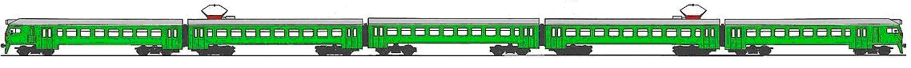

::: problemAllDefault
Електричка

На кожному вагоні електрички є табличка, на якій фарбою написано його
номер. Вагони занумеровані натуральними числами,, ...,$N$ (крайній вагон
має номер 1, сусідній з ним--- номер 2, і т. д., докрайнього з
протилежного боку вагону, який має номер $N$). Електричка має кабіни з
обох боків, іможе поїхати хоч1-им вагоном уперед, хоч$N$-им.

\>0 {width="\\textwidth"}

::: tiny
[Run not latex but pdflatex to insert
picture]{style="background-color: yellow"}
:::

::: small
[Run not latex but pdflatex to insert
picture]{style="background-color: yellow"}
:::

\> 7

Під час прибуття електрички на платформу, Вітя помітив, що
${(i\,{-}\,1)}$ штук вагонів електрички проїхали мимо нього, а$i$-й
попорядку зупинився якраз навпроти. Щевін помітив, щонатабличці цього
вагона написаний номер $j$. Щевін точно знає (іцізнання відповідають
дійсності), щоелектрички ніколи небувають нікоротшими 4 вагонів,
нідовшими 12 вагонів. Вітя хоче визначити, скільки всього вагонів
уелектричці. Напишіть програму, яка абознаходитиме цю кількість,
абоповідомлятиме, що бездодаткової інформації цезробити неможливо.

Програма має прочитати зістандартного входу (клавіатури) два цілі числа́
$i$ та $j$, розділені пропуском. ${2{\<}i{\<}12}$, ${2{\<}j{\<}12}$,
чи́сла гарантовано задовольняють всі вищезгадані обмеження.

Виведіть на стандартний вихід (екран) одне число--- кількість вагонів
уелектричці. Якщо однозначно визначити кількість вагонів неможливо,
виведіть замість кількості число `0`.

::: exampleSimple
3em3em
:::
:::
